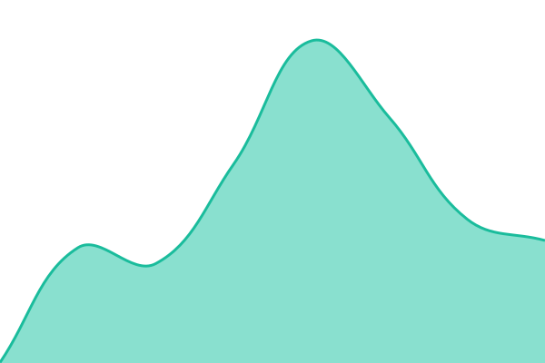
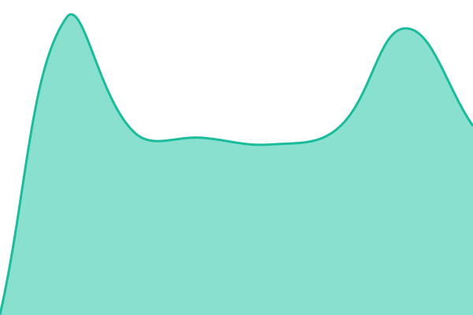
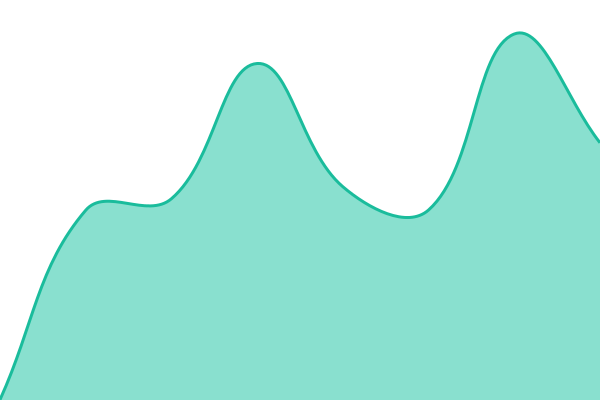
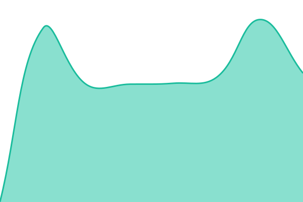

# [📈 Live Status](https://status.brianc.tech): <!--live status--> **🟧 Partial outage**

This repository contains the open-source uptime monitor and status page for [Brian Chen](https://status.brianc.tech), powered by [Upptime](https://github.com/upptime/upptime).

With [Upptime](https://upptime.js.org), you can get your own unlimited and free uptime monitor and status page, powered entirely by a GitHub repository. We use [Issues](https://github.com/differental/status/issues) as incident reports, [Actions](https://github.com/differental/status/actions) as uptime monitors, and [Pages](https://status.brianc.tech) for the status page.

<!--start: status pages-->
<!-- This summary is generated by Upptime (https://github.com/upptime/upptime) -->
<!-- Do not edit this manually, your changes will be overwritten -->
<!-- prettier-ignore -->
| URL | Status | History | Response Time | Uptime |
| --- | ------ | ------- | ------------- | ------ |
|  Portfolio | 🟩 Up | [portfolio.yml](https://github.com/differental/status/commits/HEAD/history/portfolio.yml) | 

 520ms
     
 | 

<a href="https://status.brianc.tech/history/portfolio">100.00%</a>
    

|  Blog | 🟩 Up | [blog.yml](https://github.com/differental/status/commits/HEAD/history/blog.yml) | 

 256ms
     
 | 

<a href="https://status.brianc.tech/history/blog">100.00%</a>
    

|  Portainer | 🟩 Up | [portainer.yml](https://github.com/differental/status/commits/HEAD/history/portainer.yml) | 

 694ms
     
 | 

<a href="https://status.brianc.tech/history/portainer">100.00%</a>
    

|  Enviame (Production) | 🟩 Up | [enviame-production.yml](https://github.com/differental/status/commits/HEAD/history/enviame-production.yml) | 

 680ms
     
 | 

<a href="https://status.brianc.tech/history/enviame-production">100.00%</a>
    

|  Enviame (Beta) | 🟩 Up | [enviame-beta.yml](https://github.com/differental/status/commits/HEAD/history/enviame-beta.yml) | 

 683ms
     
 | 

<a href="https://status.brianc.tech/history/enviame-beta">100.00%</a>
    

|  ErgTools | 🟩 Up | [erg-tools.yml](https://github.com/differental/status/commits/HEAD/history/erg-tools.yml) | 

 659ms
     
 | 

<a href="https://status.brianc.tech/history/erg-tools">100.00%</a>
    

|  TimeTracker | 🟩 Up | [time-tracker.yml](https://github.com/differental/status/commits/HEAD/history/time-tracker.yml) | 

 1103ms
     
 | 

<a href="https://status.brianc.tech/history/time-tracker">100.00%</a>
    

|  Git Backup | 🟥 Down | [git-backup.yml](https://github.com/differental/status/commits/HEAD/history/git-backup.yml) | 

 633ms
     
 | 

<a href="https://status.brianc.tech/history/git-backup">100.00%</a>
    

|  HedgeDoc | 🟩 Up | [hedge-doc.yml](https://github.com/differental/status/commits/HEAD/history/hedge-doc.yml) | 

 751ms
     
 | 

<a href="https://status.brianc.tech/history/hedge-doc">100.00%</a>
    

<!--end: status pages-->

[**Visit our status website →**](https://status.brianc.tech)

## 📄 License

- Powered by: [Upptime](https://github.com/upptime/upptime)
- Code: [MIT](./LICENSE) © [Anand Chowdhary](https://anandchowdhary.com), supported by [Pabio](https://pabio.com)
- Data in the `./history` directory: [Open Database License](https://opendatacommons.org/licenses/odbl/1-0/)
